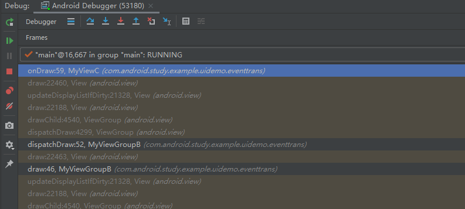

## 参考文献
https://juejin.cn/post/7152069623028908045

## 


## 问题
https://www.cnblogs.com/huansky/p/11911549.html
### 1、子线程中是否可以更新UI,为什么？
activity onCreate 里面是可以在子线程中修改TextView的text的，并且不会报异常，只有等待ui都渲染出来后，再次在子线程中更新ui，才会报异常，但也不会导致app崩溃。
异常信息：Accessibility content change on non-UI thread. Future Android versions will throw an exception

抛异常的位置在：
ViewRootImpl 类中的 requestLayout()方法， 
```
public void requestLayout() {
    if (!mHandlingLayoutInLayoutRequest) {
        checkThread();
        mLayoutRequested = true;
        scheduleTraversals();
    }
}
```


为什么在activity onCreate 中子线程更新UI不会抛出异常？
在ActivityThread的handleResumeActivity方法中，该方法首先会执行performResumeActivity即会执行到activity的onResume, 接下来会调用activity的makeVisible()方法，
该方法会调用WindowManagerImpl的addView方法。
```
void makeVisible() {
    if (!mWindowAdded) {
        ViewManager wm = getWindowManager();
        wm.addView(mDecor, getWindow().getAttributes());
        mWindowAdded = true;
    }
    mDecor.setVisibility(View.VISIBLE);
}
```


最终会调用到WindowManagerGlobal的addView，在addView中会创建ViewRootImpl, 最后与DecorView进行绑定。
```
public void addView(View view, ViewGroup.LayoutParams params,
        Display display, Window parentWindow) {

    ...
    ViewRootImpl root;
    View panelParentView = null;

    synchronized (mLock) {
        ...
        root = new ViewRootImpl(view.getContext(), display);

        view.setLayoutParams(wparams);

        mViews.add(view);
        mRoots.add(root);
        mParams.add(wparams);

        // do this last because it fires off messages to start doing things
        try {
            root.setView(view, wparams, panelParentView);
        } catch (RuntimeException e) {
            ...
        }
    }
}
```

View、ViewRootImpl、Window、WindowManager 之间有什么关系？
每个应用程序窗口的 DecorView 都有一个与之关联的 ViewRootImpl 对象，这种关联关系是由 WindowManager 来维护的，WindowManager里面有两个list列表，保存两者对象。


### View 的onDraw Canvas对象， 父View和子View都是同一个Canvas对象吗？ 
结论： 不是同一个Canvas， 每个View，都是在View 的draw方法重新创建一个Canvas对象的。并且Canvas对象的宽高是当前View的宽高
代码执行过程：

最终代码：
```
public RenderNode updateDisplayListIfDirty() {
    ...
    final RecordingCanvas canvas = renderNode.beginRecording(width, height);
    ... 
}
```